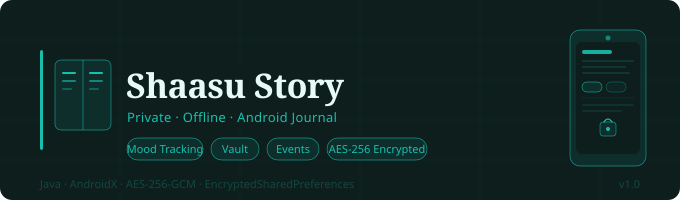

<div align="center">
  
  <p>A private, offline Android journaling app</p>
</div>

<div align="center">


A private, offline Android journaling app with mood tracking, goals, and rich story entries.

</div>

---

## Features
- 📝 Daily entries with images and custom wallpapers
- 😊 Mood tracking with monthly statistics
- 🎯 Goal setting with progress tracking
- 🔔 Reminders with custom time picker
- 🔒 Export/Import with encryption
- 📅 Calendar view with filters
- 🔐 App Lock (Username + Password login with SHA-256 hashing)
- 🗄️ Vault (PIN-protected private storage for accounts, notes, and images)
- 📆 Events (with notifications, background images, and calendar integration)

---

## Tech Stack
- Java (Android)
- AndroidX + Material Design Components
- EncryptedSharedPreferences (local storage)

---

## Security
**Updated June 2026**

### 🔐 App Lock
| Layer | Method | Persistence |
|---|---|---|
| App Entry | Username + Password (SHA-256, AES-256-GCM encrypted prefs) | Per session |
| Vault | 6-digit PIN (SHA-256, AES-256-GCM encrypted prefs) | Every open |
| Login Recovery | Multiple Q&A (configurable correct count, SHA-256 hashed) | Forgot password |
| PIN Recovery | Single Q&A with case-sensitivity toggle (SHA-256 hashed) | Forgot PIN |

### 🗄️ Vault
- Category grid: Gmail, Instagram, Game Accounts, Other Accounts, Personal Notes
- Add entries with image upload — stored as base64 in encrypted prefs
- Copy-to-clipboard, password visibility toggle, real-time search (name, note, tags, category)
- Reset Recovery available inside Vault header
- All data encrypted via `VaultStore` (AES-256-GCM)

### 📆 Events
- Create/edit/delete events with title, note, date, and repeat (Yearly / Once)
- Background images with opacity slider — stored as base64 in encrypted `EventStore`
- Per-event notification toggle + master "Enable Alerts" toggle
- Exact alarms via `ReminderScheduler` + `AlarmManager`; handled by `ReminderReceiver`
- Event cards grouped: Today / Past / This Month / Upcoming
- Calendar view shows dots on days with events
- Stats tab: mood bar chart + Best Day in Weeks with time range filter

### 📦 Export / Import
- Encrypted envelope: `{ format, enc, kdf, iter, salt, iv, ct }`
- AES-256-GCM + PBKDF2/HMAC-SHA256 (200K iterations)
- Contains: stories, reminders, events, vault entries (with images), vault PIN + recovery
- Auto-detects encrypted vs legacy format on import
- ⚠️ Encrypted backups are not recoverable if the export password is forgotten

---

## Getting Started

### Prerequisites
- Android Studio
- Android SDK

### Run
1. Clone the repo and open in Android Studio
2. Sync Gradle
3. Run on an emulator or physical device

## Build
```bash
./gradlew assembleDebug
```

---

## Upcoming Features
- 🌤️ Weather Log — view upcoming weather tied to calendar dates
- ☁️ Dropbox Integration — one-click encrypted backup and restore
- 🔐 Biometric Authentication — for Vault access

---

## License
MIT License — use it, change it, build on it. Just keep my name on it. If something breaks, that's on you.

© 2026 Don Maglalang
